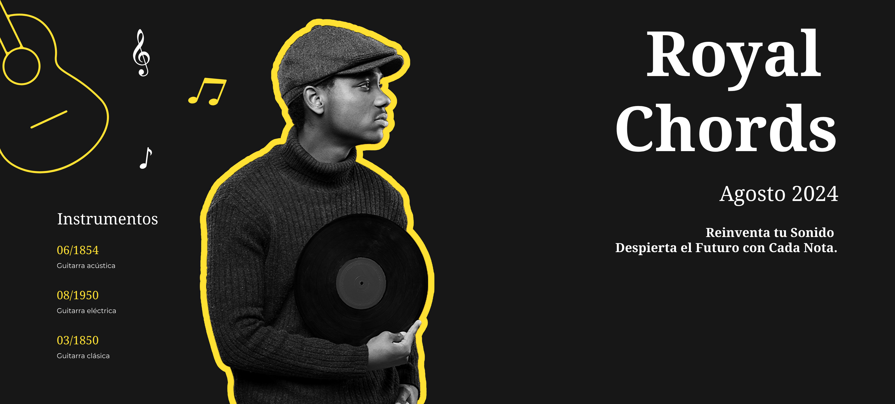
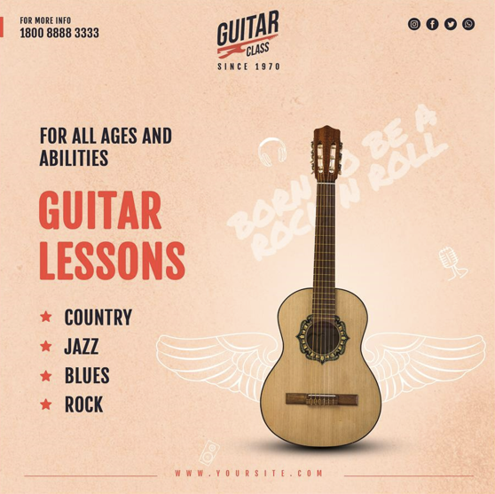
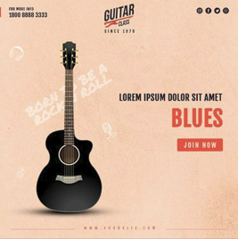
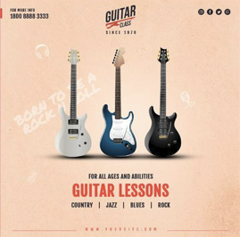
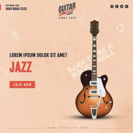
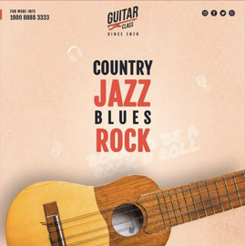

<h1 align="center">ROYAL CHORDS</h1>
<h2 align="center">Tienda de guitarras online</h2>
<p>Royal Chords es una aplicación diseñada para músicos y compositores, que facilita la creación de progresiones de acordes de manera intuitiva. Con una interfaz amigable y herramientas interactivas, puedes experimentar con diferentes combinaciones armónicas y explorar nuevas ideas musicales fácilmente. </p>

.png?raw=true)


  
  
 

# INDICE

[Introduccion](#introduccion)

[Estructura](#estructura)

[Visualizacion](#visualizacion)

[Tecnologias](#tecnologias)

[Codificacion](#codificacion)

[Despliegue](#despliegue)


## Introduccion
<p>Cambio en la operación: Para calcular la velocidad, debes dividir la distancia recorrida (dist) por el tiempo total (tiempo) en minutos. He corregido la línea dentro del método operacion a let vel = this.dist / tiempo;.
Uso de console.log: Se debe llamar al método operacion() para obtener el valor de la velocidad y mostrarlo en la consola.
El método operacion ahora devuelve la velocidad en términos de distancia por minuto, y este valor se imprime correctamente con console.log(velocidad.operacion());.</p>


## Estructura
**Header** : 

**Catalogo** :

**Apartado Nosotros**: 

**Footer** :

## Visualizacion
Se detallan las consideraciones de diseño y usabilidad de la landing page, incluyendo aspectos como:

Diseño Responsivo: La CRUD APP se adaptada a diferentes dispositivos móviles facilitando su visualización.
Paleta de Colores: Se utilizaron conceptos de psicología del color y diseño gráfico para internet a fin de generar una experiencia de usuario inigualable.
Tipografía: Se incorporaron estilos vanguardista de diseño editorial para generar una mejor experiencia del lectura a los visitantes.


## Tecnologias
Lista de las tecnologías y herramientas utilizadas para el desarrollo de la landing page, tales como:

**HTML5**: Estructuración del contenido buscando el estándar que incorpora las últimas tendencias de maquetación.

**CSS3**: Estilos y diseño visual aconmpañados de técnicas como flat design y UX/UI

## Codificacion

### HTML
```
<!DOCTYPE html>
<html lang="en"> 
<head>
    <meta charset="UTF-8">
    <meta name="viewport" content="width=device-width, initial-scale=1.0">
    <title>Royal Chords</title>
    <link rel="stylesheet" href="style.css">
    <link rel="stylesheet" href="https://cdnjs.cloudflare.com/ajax/libs/font-awesome/6.0.0-beta3/css/all.min.css">
    <link rel="shortcut icon" href="imagenes/image (2).png" type="image/x-icon">
</head>

<body>
    <!-- menu  -->
     <div class="inicio">

     
<header>
    <!-- Logo y buscador -->
        <div class="logo">
            
        </div>
        <nav class="menu">
                <ul class="listaE">
                    <li><a href="#Inicio" id="inicio1"> Inicio</a></li>
                    <li><a href="Nosotros.html"> Nosotros</a></li>
                    <li><a href="#Productos"> Productos</a></li>
                    <li><a href="#Contacto"> Contacto</a></li>
                </ul>
                <form action="" class="lupa">
                    <input type="search" placeholder="Qué deseas buscar?">
                    <i class="fa-solid fa-magnifying-glass"></i>
                </form>
        </nav>
        
</header> 

<br><br><br><br><br><br><br><br><br>


<hr>
    
</div>
<section>
    
    <form action="" class="btn-registro">
        <input type="email" placeholder="ejemplo@ejemplo.com">
        <button type="submit">Registrarse</button>
    
    </form>
</section>


<section class="sec-productos">

        <div class="productoGrande">
            
        </div>

        <div class="productoPequeño">
            <div></div>
            <div></div>
            <div></div>
            <div></div>
        </div>
</section>

<section class="banner">
    
    <button> <a href="Nosotros.html">APRENDE MAS SOBRE NOSOTROS</a> </button>
</section>

<footer class="footer">
       <div class="footer-logo">
        
       </div>
       <div class="footer-contacto">
        <h3>Contacto</h3>
        <h3>email: royalchords@gmail.com</h3>
        <h3>Telefono: 3152659858</h3>
    </div>
    <div class="footer-redes">
        <h2>Siguenos en redes sociales</h2>
        
    </div>
     
</footer>
<div class="fondo">
    <hr class="barra">
    <h4>Royal Chords @2024-Todos los derechos reservados</h4>
    <h2>PRUEBA GITHUB</h2>
</div>

</body>
</html>
```

## Despliegue

[EJEMPLO](https://ejemplocrudapp.netlify.app/)


